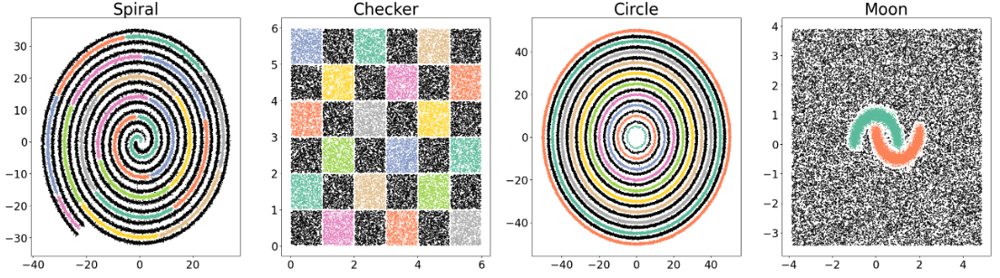

# 2ood
2d toy datasets for detecting out of distribution

### Spiral
$20$ classes
- Train: 20000
- Test: 5000
- OOD: 39850

### Checker
$18$ classes
- Train: 19998
- Test: 4986
- OOD: 19998

### Circle
$10$ classes
- Train: 60470
- Test: 60470
- OOD: 51410

### Moon
$2$ classes
- Train: 10000
- Test: 5000
- OOD: 23025
